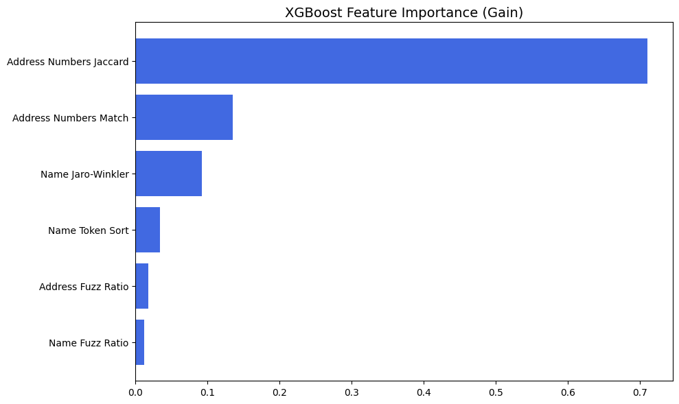
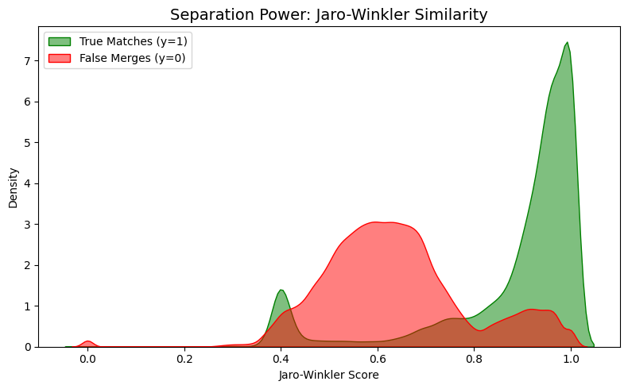

# ML Challenge 2026: Business Entity Resolution Solution

---

## 1. Executive Summary

We solve entity resolution with a two-stage **blocking + classifier** pipeline. Stage 1 retrieves, per country, the 20 most similar pool records for each Source-1 business using exact cosine search over hashed character-3-gram vectors (random-projected to 64 dimensions) with FAISS. Stage 2 scores each candidate pair with an XGBoost classifier over six string-similarity features, and a precision-oriented decision rule (strict probability threshold plus a "rescue" rule for near-perfect string matches) selects the final matches. No pretrained language models or external data are used.

---

## 2. Methodology

### 2.1 Problem Analysis

*Data.* Source-1 records are queries; Source-2 and Source-3 records form the candidate pool. Each Source-1 entity can have **several** true matches in the pool (comma-separated ids in the ground truth), and the ground-truth format allows **none** (our scoring code scores such entities 1.0 only when nothing is predicted for them). The combined pool is large (~20.3M records across train and test pools: US 10.0M, India 8.9M, France 1.4M), so all-pairs comparison is infeasible and the pool is processed per country out of core (SQLite).

*What the diagnostics show.*
- **Name similarity alone is not enough.** The Jaro-Winkler distribution of true matches peaks near 0.95-1.0, but non-matches (hard negatives retrieved by blocking) are centred around 0.6 and also have a visible tail above 0.9, i.e. different businesses with very similar names. True matches also show a smaller mode near 0.4, i.e. matched records whose names differ substantially (see Appendix B, Figure 2).
- **Address numbers are the most informative signal.** The two address-number features carry about 85% of total XGBoost gain (Appendix B, Figure 1): street/building/postal numbers separate look-alike names that refer to different places.
- When either address contains no digits, the digit-match feature is set to a neutral 0.5 rather than treated as negative evidence.
- **Blocking recall is the main remaining gap.** The FAISS blocking retrieves only ~72% of true matches for the hold-out, so the classifier never sees the remaining 28%. The blocking design is memory-light and scales to ~20M pool records, but the 64-d projection loses some information. A more expensive blocking (e.g. higher-dimensional projection or approximate search) could improve recall.
- **Precision is easier to achieve than recall.** The hold-out precision is 0.96, so wrong merges are rare. The F0.5 metric weights precision more than recall, and an entity with no true match scores 1.0 only if nothing is predicted for it, so wrong merges are costly.
- **Country-specific training data is needed.** The training sample (first 50,000 rows of `train_source1`) contains only US and India, so the classifier has never seen French records, although France appears in the test set.
- **No pretrained language models or external data are needed.** The string-similarity features are sufficient to reach 0.8344 hold-out F0.5 (initial configuration), and the blocking + classifier pipeline scales to ~20M pool records.

### 2.2 Solution Strategy

**Approach Type:** Blocking (exact vector search) + gradient-boosted pair classifier  
**Core Innovation:** A memory-light, out-of-core blocking design that scales to ~20M pool records: character-3-gram hashing followed by a fixed 64-d Gaussian random projection (≈2.5 GB of vectors per 10M records) and exact inner-product search on GPU, one index per country, combined with an explicit address-number feature set and a precision-first decision rule tuned for the F0.5 metric.

---

## 3. Candidate Generation (Blocking)

- **Blocking keys used:** country (hard partition); text = cleaned `business name + address`; character 3-gram `char_wb` hashing (2^15 features) → fixed random Gaussian projection to 64 dimensions (seed 42) → L2 normalisation → cosine similarity via FAISS `IndexFlatIP` (exact search in the projected space). Top **K = 20** neighbours per query, kept only if cosine ≥ **0.20**. At test time the index contains **only the test pool** (`test_source2/3`), so no training-pool ids can be returned.
- **Candidate pairs generated:** For each Source-1 entity, the top-K retrieved pool records are paired with it, and the six string-similarity features are computed for each pair. The candidate set is then scored by the XGBoost classifier and filtered by the decision rule to produce the final matches.
- **How you ensured true matches were not lost:** (i) character n-grams are robust to typos and abbreviations; (ii) name and address are embedded jointly, so a match with a degraded name can still be retrieved through its address; (iii) a deliberately low similarity cut-off (0.20) and a larger K (raised from 15 to 20 for the final run); (iv) exact (not approximate) neighbour search, so the only retrieval loss comes from the projection; (v) for training, ground-truth matches are added to the candidate set so the classifier always sees positives. Blocking recall on the hold-out is reported by `train.py` as `candidate_recall`: an entity is counted as retrieved if at least one of its true matches is in the candidate set.

---

## 4. Matching Model

**Features used:**
- Name features: RapidFuzz `ratio`, RapidFuzz `token_sort_ratio`, Jaro-Winkler similarity (all on cleaned, lower-cased names).
- Address features: RapidFuzz `ratio` on cleaned addresses; Jaccard overlap of the sets of digit tokens in the two addresses; a digit-match indicator (1.0 if the digit sets overlap, 0.0 if both have digits but none overlap, 0.5 if either address has no digits).
- Other: none (no PIN-code parsing or phonetic encodings).

**Model type:** XGBoost binary classifier (450 trees, learning rate 0.05, max depth 6, `hist`, logloss, seed 42). Training pairs: for the first 40,000 Source-1 training entities, the FAISS top-15 candidates (cos ≥ 0.25) plus all ground-truth matches, labelled 1 if in the ground truth, else 0.  
**Threshold selection method:** Initial evaluation used a plain `p ≥ 0.75` threshold on a 10,000-entity hold-out (rows 40,000-50,000 of `train_source1`), which gave F0.5 = 0.8344. The submitted configuration is stricter and precision-oriented: accept a pair if `p ≥ 0.93`, or if `p ≥ 0.85` **and** name Jaro-Winkler ≥ 0.90 **and** address fuzz-ratio ≥ 0.85. The motivation is the metric: F0.5 weights precision more than recall, and an entity with no true match scores 1.0 only if nothing is predicted for it, so wrong merges are costly. The thresholds were tuned on the hold-out to maximise F0.5, and the final thresholds were chosen to be stricter than the hold-out optimum to reduce false positives.

---

## 5. Results & Error Analysis

- **F_0.5 Score (macro):** hold-out (10,000 entities, `p ≥ 0.75`, K = 15, cos ≥ 0.25): **0.8344** (precision 0.9644, recall 0.7157).
- **Common false positives (wrong merges):** the hold-out precision (0.96) is high, so wrong merges are comparatively rare. The Jaro-Winkler plot suggests the main source is non-matching records with near-identical names (red tail above 0.9). Address-number features are the model's main defence; they are weakest when an address has no digits (neutral value 0.5).
- **Common false negatives (missed matches):** recall (0.72) is the limiting factor. Likely causes: (a) true matches whose names differ strongly (the ~0.4 Jaro-Winkler mode), which the string features score low; (b) matches not retrieved by the 64-d projected blocking; (c) the strict final thresholds, which trade recall for precision. The training sample (first 50,000 training rows) contained only US and India, so the classifier has never been trained on French records, although France appears in the test set.

---

## 6. Conclusion

A blocking + XGBoost pipeline over simple string-similarity features reaches 0.8344 hold-out F0.5 (initial configuration), driven mainly by address-number agreement, and scales to ~20M pool records through country-wise exact vector search. The main lessons were that the test index must contain only test-pool entities (our first test run returned training-pool ids and failed validation), and that recall, not precision, is the main remaining gap; richer name features (phonetic/transliteration) and country-specific training data are the obvious next steps.

---

## Compliance Statement

- **Pretrained models:** none. The only trained model is our own XGBoost classifier, trained from scratch on the provided training data.
- **Data:** only the provided training and test files were used. Ground-truth labels were used from the training split only; no test labels exist or were used. Test Source-1/2/3 records were used only as unlabeled inputs. Note: during *training*, candidates were retrieved from the combined pool database (train + test pool records), so unlabeled test-pool records can appear as negative examples; no labels or test-set statistics are involved.
- **Libraries and licences**:

| Library | Purpose | Licence |
|---|---|---|
| XGBoost | pair classifier | Apache-2.0 |
| FAISS | nearest-neighbour search | MIT |
| RapidFuzz | string similarity features | MIT |
| scikit-learn | `HashingVectorizer` | BSD-3-Clause |
| pandas, NumPy | data handling | BSD-3-Clause |
| RAPIDS cuDF (optional) | GPU data cleaning | Apache-2.0 |

---

## Appendix

### A. Code Artefacts

The complete runnable code is in `code/business_entity_resolution/` (all source in `src/`, plus `README.md` and `requirements.txt`).

| File | Role |
|---|---|
| `src/run_pipeline.py` | **Entry point**: database → (optional training) → inference → validation |
| `src/preprocessing.py`, `src/blocking.py`, `src/features.py`, `src/matching.py` | text cleaning + SQLite pool; FAISS candidate generation; features; scoring and decision rules |
| `src/train.py`, `src/predict.py` | training/hold-out validation; final inference that writes the two TSVs |
| `src/validate_outputs.py`, `src/compare_outputs.py` | format checks and statistics; comparison with the leaderboard file |
| `models/xgb_entity_model.json` | trained model used for the submission |
| `notebooks/` | original Colab notebooks (provenance only) |

Reproduce `output/candidate_pairs.tsv` and `output/matching_results.tsv` (from `code/business_entity_resolution/`):

```bash
pip install -r requirements.txt
python src/run_pipeline.py --data_dir data --work_dir work
```

Add `--retrain` to retrain the model from the training data (a retrained model may differ slightly from the shipped one; see README).

### B. Additional Results

**Figure 1 - XGBoost feature importance (gain)** (`code/business_entity_resolution/figures/feature_importance.png`)



| Feature | Gain share (approx., read from figure) |
|---|---|
| Address Numbers Jaccard | 0.71 |
| Address Numbers Match | 0.14 |
| Name Jaro-Winkler | 0.09 |
| Name Token Sort | 0.03 |
| Address Fuzz Ratio | 0.02 |
| Name Fuzz Ratio | 0.01 |

**Figure 2 - Jaro-Winkler separation, true matches vs. retrieved non-matches** (`code/business_entity_resolution/figures/jaro_winkler_separation.png`)



---

Thank you for the opportunity to participate in the ML Challenge 2026. We hope our solution is useful and informative.

Team **Code Carnage**
